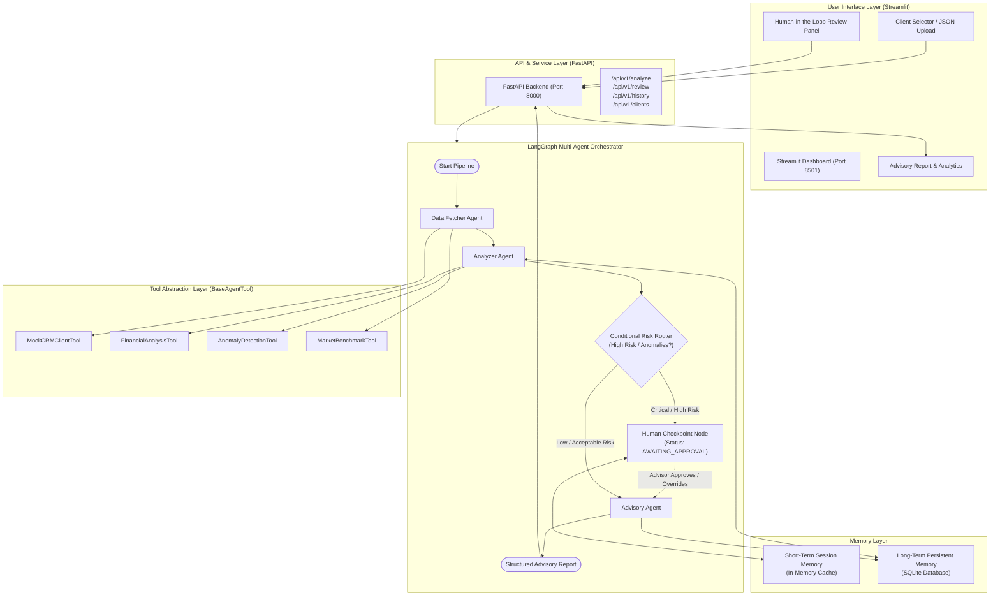
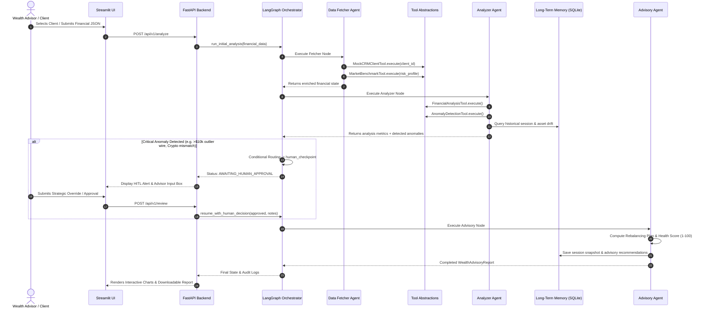

# Wealth Advisor Assistant — AI Multi-Agent System

An enterprise-grade, agent-based Wealth Advisor Assistant built with **Python**, **FastAPI**, **LangChain**, **LangGraph**, and **Streamlit**. The system ingests client financial data, retrieves CRM context, performs quantitative portfolio and anomaly detection analysis, engages a **Human-in-the-Loop (HITL)** governance gate on high-risk findings, and generates structured wealth advisory directives.

---

## 🌟 Key Highlights & Requirements Fulfillment

| Core Requirement | Implementation Details | Status |
|---|---|---|
| **1. Orchestrator Agent** | Central coordinator powered by **LangGraph `StateGraph`** with dynamic state machine routing and status transitions. | ✅ Complete |
| **2. Specialized Agents (3+ Agents)** | **Data Fetcher Agent**, **Analyzer Agent**, and **Advisory Agent** with modular single responsibilities. | ✅ Complete |
| **3. Tool Usage Abstraction** | Abstract base class `BaseAgentTool` decoupling agents from raw implementations; encapsulates execution timing, metadata, and error handling. | ✅ Complete |
| **4. Anomaly Detection** | Identifies statistical transaction outliers (>3x mean), rapid outflows (>150% monthly income), risk tolerance mismatch (e.g. conservative equity/crypto overload), and leverage risks. | ✅ Complete |
| **5. Error Handling & Stability** | Pydantic schema validation, resilient fallbacks for CRM timeouts/outages, division-by-zero protection, and graceful degradation. | ✅ Complete |
| **6. Observability & Logging** | Structured logging with timestamps, agent actions, execution durations, and step-by-step audit logs surfaced in the API and Streamlit UI. | ✅ Complete |
| **Bonus: Memory Layer** | **Short-term memory** (session context / HITL pause state) + **Long-term memory** (persistent SQLite store tracking historical net worth, health score, and asset drift). | ✅ Complete |
| **Bonus: Human-in-the-Loop (HITL)** | Autonomous workflow pauses at high-risk anomalies, allowing wealth advisors to validate or override recommendations before final report generation. | ✅ Complete |
| **Frontend & Backend** | **FastAPI** REST API backend + **Streamlit** interactive financial dashboard with visualizations. | ✅ Complete |

---

## 🏗️ Architecture Design

The architecture is designed around decoupled agents interacting via a shared typed state (`AdvisorState`), utilizing clean tool abstractions and layered persistence:



---

## 🤖 Agent Roles & Interaction Flow



### 1. Data Fetcher Agent
- Ingests incoming financial JSON data.
- Enforces strict Pydantic schema validation (`ClientFinancialData`) while offering fallback normalization if non-essential keys are missing.
- Queries `MockCRMClientTool` for KYC compliance, client relationship status, tax bracket, and stated goals.
- Queries `MarketBenchmarkTool` for macroeconomic indicators and model target asset allocations.

### 2. Analyzer Agent
- Executes `FinancialAnalysisTool` to compute Net Worth, gross assets, liabilities, debt-to-asset leverage, cash flow surplus, and emergency liquid reserve months.
- Executes `AnomalyDetectionTool` across transactions and portfolio balances:
  - **Unusual Transactions**: Outlier payments/transfers exceeding $10,000 and 3x client historical average.
  - **Rapid Outflows**: Total monthly withdrawals exceeding 150% of monthly income.
  - **Risk Mandate Violations**: Flags conservative clients holding speculative crypto (>1%) or excessive equities (>35%), or aggressive clients holding excessive idle cash (>45%).
  - **High Leverage & Liquidity Shortfalls**: Debt-to-asset > 50% or emergency reserve < 3 months.
- Queries `LongTermMemoryStore` to calculate net worth growth and allocation drift against previous review sessions.

### 3. Advisory Agent
- Formulates target rebalancing trades (`INCREASE`, `DECREASE`, `HOLD`) with exact dollar estimates.
- Calculates an objective **Financial Health Score** (1 to 100) based on leverage, cash flow, liquidity, and anomaly severity penalties.
- Formulates high-priority action recommendations (Risk Mitigation, Portfolio Realignment, Emergency Reserves, Tax Planning).
- Synthesizes executive summaries and risk assessments using Groq when `GROQ_API_KEY` is configured, or an expert deterministic rule engine otherwise.
- Persists final session state to Long-Term Memory.

---

## 🛠️ Tool Usage Abstraction

Agents **never interact directly with raw APIs or ad-hoc calculation scripts**. All tools inherit from `BaseAgentTool` (`src/tools/base.py`):

```python
class BaseAgentTool(ABC):
    name: str
    description: str

    def execute(self, **kwargs) -> ToolResult:
        # Uniform execution timing, exception handling, and audit telemetry
        ...
```

- **`MockCRMClientTool`**: Simulates Salesforce/Wealthbox CRM API records, KYC verification, and relationship notes. Includes simulated failure mode for fallback testing.
- **`FinancialAnalysisTool`**: Pure quantitative engine computing net worth, concentration risks, and cash flow buffers.
- **`AnomalyDetectionTool`**: Rules and statistical outlier detector for transaction and risk anomalies.
- **`MarketBenchmarkTool`**: Provides baseline interest rates, inflation figures, and target portfolio allocations.

---

## 🧠 Memory Layer

1. **Short-Term Memory (`src/memory/short_term.py`)**:
   - In-memory session manager that retains intermediate graph states during paused workflows.
   - Enables asynchronous human-in-the-loop review cycles without state loss.
2. **Long-Term Memory (`src/memory/long_term.py`)**:
   - Persistent **SQLite** database (`data/wealth_advisor_memory.db`).
   - Automatically tracks historical net worth, total assets, health scores, and asset allocation percentages over time.
   - Detects multi-session drift (e.g. *"Equity has increased by +12.5% since prior session on 2024-08-15"*).

---

## 🛡️ Human-in-the-Loop (HITL) Checkpoint

Autonomous AI actions in financial wealth management require compliance safeguards. 
- When the **Analyzer Agent** detects critical anomalies (unusual large wires, crypto violations, excessive leverage), the LangGraph conditional router directs the pipeline to the `human_checkpoint` node.
- The pipeline transitions to `AWAITING_HUMAN_APPROVAL`.
- The registered wealth advisor reviews the anomalies in the Streamlit UI, inputs supervisory instructions (e.g. *"Client confirmed wire legitimacy; cap equity trim at 15%"*), and authorizes the workflow.
- The **Advisory Agent** receives the approved state and incorporates the advisor's instructions directly into the final report.

---

## ⚖️ Key Decisions and Trade-offs

1. **Deterministic Expert Engine vs. LLM-Only**:
    - *Decision*: Provide full deterministic rule-based analysis and synthesis out-of-the-box, with optional Groq LLM enhancement if `GROQ_API_KEY` is present.
   - *Trade-off*: Eliminates external API dependencies and costs for evaluators while guaranteeing 100% reproducible financial calculations.
2. **LangGraph StateGraph for Orchestration**:
   - *Decision*: Used LangGraph `StateGraph` over legacy linear chains or raw loops.
   - *Trade-off*: Slightly more upfront structure, but provides first-class state transitions, conditional branching, checkpointing, and auditability.
3. **Decoupled FastAPI Backend & Streamlit Frontend**:
   - *Decision*: Ran the backend as a headless REST API with Streamlit as the consumer.
   - *Trade-off*: Requires running two lightweight processes, but ensures production-ready separation of concerns, multi-channel consumption, and independent scalability.
4. **SQLite for Long-Term Memory**:
   - *Decision*: Embedded SQLite for historical memory instead of complex cloud databases.
   - *Trade-off*: Zero setup friction, zero external services needed, fully self-contained.

---

## 📌 Assumptions Made

1. **Currency**: All figures are denominated in USD.
2. **Transaction Windows**: Ingested transactions represent the preceding 30–60 day evaluation cycle.
3. **Emergency Fund Benchmark**: Standard wealth management guideline recommends 3 to 6 months of living expenses in liquid cash reserves.
4. **Concentration Risk Benchmark**: Any single asset holding accounting for >25% of gross assets triggers a concentration risk alert.
5. **Human Approval Threshold**: Triggered whenever any `CRITICAL` or `HIGH` severity anomaly is detected or debt-to-asset leverage exceeds 45%.

---

## 🚀 Instructions to Run the Project

### Prerequisites
- Python 3.10+ (tested and running on Python 3.14)
- Git

### 1. Clone & Set Up Virtual Environment

```bash
# Clone the repository
git clone <repo-url>
cd Project1

# Create and activate virtual environment
python -m venv .venv

# On Windows:
.venv\Scripts\activate

# On macOS/Linux:
source .venv/bin/activate

# Install dependencies
pip install -r requirements.txt
```

### 2. Configure Environment
Copy `.env.example` to `.env` and add your Groq API key locally:
```bash
# Groq API Configuration (let me know if you need an .env file)
GROQ_API_KEY=your_groq_api_key
GROQ_MODEL=openai/gpt-oss-120b

# Server Port Settings
FASTAPI_HOST=127.0.0.1
FASTAPI_PORT=8000
STREAMLIT_PORT=8501
```
*(The system supports ultra-fast Groq LLM inference via LangChain `ChatGroq`, and seamlessly falls back to the deterministic expert engine if no keys are provided).*

### 3. Start the FastAPI Backend
In your first terminal:
```bash
python run_server.py
```
- The backend will start on **`http://127.0.0.1:8000`**.
- Interactive Swagger API Documentation is available at **`http://127.0.0.1:8000/docs`**.

### 4. Start the Streamlit Frontend
In a second terminal:
```bash
python run_ui.py
```
- The frontend will launch at **`http://localhost:8501`**.

### 5. Automated Test Suite / Verification Script
To test the entire multi-agent pipeline and API end-to-end via command line:
```bash
python test_api.py
```

---

## 📁 Repository Structure

```
├── .env.example                               # Environment configuration template
├── README.md                                  # Comprehensive architecture documentation
├── requirements.txt                           # Project dependencies
├── run_server.py                              # FastAPI backend launcher
├── run_ui.py                                  # Streamlit frontend launcher
├── test_api.py                                # End-to-end API integration test
├── test_run.py                                # Direct multi-agent pipeline test
├── samples/                                   # Sample client inputs and API outputs
│   ├── sample_client_conservative.json        # Conservative profile with crypto/wire anomalies
│   ├── sample_client_aggressive_anomalies.json# Aggressive profile with RSU concentration
│   ├── sample_client_moderate_drift.json      # Balanced profile with healthy cash flows
│   └── sample_api_output.json                 # Complete sample API response
├── data/
│   └── wealth_advisor_memory.db               # SQLite database for Long-Term Memory
└── src/
    ├── config.py                              # Settings & logging configuration
    ├── models/
    │   ├── schemas.py                         # Pydantic schemas for domain objects
    │   └── state.py                           # LangGraph AdvisorState definition
    ├── tools/                                 # Tool Usage Abstraction Layer
    │   ├── base.py                            # BaseAgentTool & ToolResult interfaces
    │   ├── crm_tool.py                        # Mock CRM Client Tool
    │   ├── finance_tool.py                    # Portfolio Analysis Tool
    │   ├── anomaly_tool.py                    # Anomaly & Risk Detection Tool
    │   └── market_tool.py                     # Market Benchmark Tool
    ├── memory/                                # Memory Layer
    │   ├── short_term.py                      # Session State Memory Manager
    │   └── long_term.py                       # Persistent SQLite Long-Term Memory Store
    ├── agents/                                # Multi-Agent Layer
    │   ├── data_fetcher_agent.py              # Ingestion & CRM enrichment agent
    │   ├── analyzer_agent.py                  # Quantitative & anomaly detection agent
    │   ├── advisory_agent.py                  # Strategic wealth directive generator
    │   └── orchestrator.py                    # LangGraph StateGraph coordinator
    ├── api/
    │   └── main.py                            # FastAPI routes and endpoints
    └── ui/
        └── app.py                             # Streamlit dashboard
```

---

## 🧪 Sample Input & Output

Sample input and output files are provided in the [`samples/`](./samples/) directory:

- **Input Sample**: [`samples/sample_client_conservative.json`](./samples/sample_client_conservative.json)
  Contains client profile, asset holdings, mortgage liabilities, and transactions including a $45,000 unverified wire.
- **Output Sample**: [`samples/sample_api_output.json`](./samples/sample_api_output.json)
  Contains the full JSON response with:
  - `financial_health_score`: `45/100`
  - `executive_summary`: Tailored summary incorporating human advisor override notes.
  - `anomalies`: Outlier transaction, rapid outflow, and equity/crypto risk mismatches.
  - `rebalance_plan`: Specific trade actions per asset category.
  - `actionable_recommendations`: Prioritized advisory steps.
  - `audit_logs`: Detailed execution trace.
